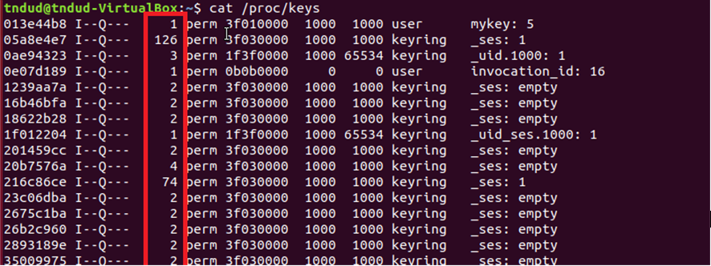
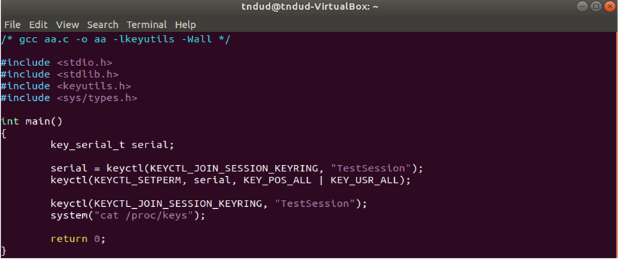

<center>

# CVE-2016-0728
## Analysis Report
## Analysis report on join_session_keyring function

#### First reporter : Yevgeny Pats(2016-01-19 22:09:04 +0000)

#### Athor : tndud042713

#### Date Created : 2022.06.29

<br>
<br>
<br>
</center>
<div style="page-break-after: always; visibility: hidden">
/pagebreak
</div>


* * *
# Index
### 1. Introduce
### 2. Code audit
### 3. PoC
### 4. Exploit
### 5. Reference
<br>
<div style="page-break-after: always; visibility: hidden">
/pagebreak
</div>

* * * 

<br>

# 1. Introduce

<br>
<br>

<p>&nbsp;&nbsp;2016년 1월 19일 Yevgeny Pats가 발견한 vulnerability이다. 이 vulnerability는 2016년보다 이전인 2012년부터 존재했었던 vulnerability이지만, 2016년에 발견되었다. 이 vulnerability은 security/keys/process_keys.c에 있는 join_session_keyring function 이 certain error case 에서 object references를 mishandles 하면서 생기는 vulnerability로 알려져있다.
</p>
<p>
&nbsp;&nbsp;CVE-2016-0728은 CVSS Common Vulnerability Scoring System (공통 취약점 등급 시스템)
에서 각각 version에 따라 높은 등급을 받은 취약점이다. CVSS2.0에서는 7.2 HIGH score를 받았고, CVSS3.x에서는 7.8 HIGH score를 받았다. 이 vulnerability가 HIGH score를 받은 원인을 분석해 보면 Linux OS PC와 Android device의 약 70%에 영향을 줄 수 있기 때문이다. 
</p>
<br>
<div style="page-break-after: always; visibility: hidden">
/pagebreak
</div>

***

# 2. Code audit
<br>
<br>

<p>&nbsp;&nbsp;Vulnerability의 분석을 위해서 join_session_keyring function이 certain error case에서 object references를 mishandles 하면서 생기는 vulnerability에 주목해서 vulnerability를 확인한다. security/keys/process_keys.c를 비교하면서 왜 새로운 부분이 생겨났는지 확인해보려고 한다.</p>
<br>
<b>security/keys/process_keys.c</b>
<br>

```C {.line-numbers}
 long join_session_keyring (const char *name )
{
	const struct cred *old ;
	struct cred *new ;
	struct key *keyring ;
	long ret ,serial ;   
	new =prepare_creds ();
	if (!new )
		return -ENOMEM ;
	old =current_cred ();

	/* if no name is provided, install an anonymous keyring */

	if (!name ){
		ret =install_session_keyring_to_cred (new ,NULL );
		if (ret <0 )
			goto error ;

		serial =new ->session_keyring ->serial ;
		ret =commit_creds (new );
		if (ret ==0 )
			ret =serial ;
		goto okay ;
	}
```
```C {.line-numbers}

	/* allow the user to join or create a named keyring */
	mutex_lock (&key_session_mutex );

	/* look for an existing keyring of this name */
	keyring =find_keyring_by_name (name ,false );
	if (PTR_ERR (keyring )==-ENOKEY ){
		/* not found - try and create a new one */
		keyring =keyring_alloc (
			name ,old ->uid ,old ->gid ,old ,
			KEY_POS_ALL |KEY_USR_VIEW |KEY_USR_READ |KEY_USR_LINK ,
			KEY_ALLOC_IN_QUOTA ,NULL );
		if (IS_ERR (keyring )){
			ret =PTR_ERR (keyring );
			goto error2 ;
		}
	}else if (IS_ERR (keyring )){
		ret =PTR_ERR (keyring );
		goto error2 ;
	}else if (keyring ==new ->session_keyring ){
		key_put (keyring );// 빨간색으로 변경해보기
		ret =0 ;
		goto error2 ;
	}

	/* we've got a keyring - now to install it */
	ret =install_session_keyring_to_cred (new ,keyring );
	if (ret <0 )
		goto error2 ;

	commit_creds (new );
	mutex_unlock (&key_session_mutex );

	ret =keyring ->serial ;
	key_put (keyring );
    okay :
	return ret ;

    error2 :
	mutex_unlock (&key_session_mutex );
    error :
	abort_creds (new );
	return ret ;
    }
```

<p>
패치 이후에 바뀐 것은 <span style="color: red">key_put (keyring );</span>이 추가되었다. key_put()의 역할을 알아보기 위해서 /security/keys/key.c에 있는 key_put()을 참조해보면
</p>
<br>
<b>/security/keys/key.c</b>
<br>

```C {.line-numbers}
/**
 * key_put - Discard a reference to a key.
 * @key: The key to discard a reference from.
 *
 * Discard a reference to a key, and when all the references are gone, we
 * schedule the cleanup task to come and pull it out of the tree in process
 * context at some later time.
 */

void key_put (struct key *key )
{
	if (key ){
		key_check (key );

		if (atomic_dec_and_test (&key ->usage ))
			schedule_work (&key_gc_work );
	}
}
```

<p>
reference가 끝났을 때 key에 대한 reference를 모두 버리는 역할을 한다. 이 역할이 join_session_keyring에 적용된다면 원래 있던 vulnerability인 count가 reference가 끝나도 끊임없이 increase 하는 문제를 해결 할 수 있다.
</p>



<p>
표시한 부분이 count이며 계속 increase한다.
이 reference count의 type이 int 이므로 2^32번 참조하면 Integer Overflow가 발생한다.
</p>

<br>
<div style="page-break-after: always; visibility: hidden">
/pagebreak
</div>

***

# 3. PoC
<br>
<br>
<p>
reference count가 계속 increse 할수 있는지에 대해서 proof 해보려고 한다.</p>

<b>~$ vim aa.c</b>

<br>



<br>

<p>
이 code를 이용하여 reference count가 계속 증가하는지 확인한다. Configuration은 Linux tndud-VirtualBox 3.18.25이고 ubuntu-18.04.6-desktop-amd64.iso에서 구동하고 있다.
</p>

<b>~$ gcc aa.c –o aa –lkeyutils –Wall</b>

<b>~$ ./aa</b>


<p>reference count가 계속 증가하는 것을 확인할 수 있다. reference count가 Integer Overflow가 나는 것을 증명하기 위해서 aa.c의 파일을 수정한 후에 다시 compile 하였다.</p>


<p>이 코드를 실행시키면</p>


<p>cat /proc/keys의 값을 보여주지 않고 커서만 깜빡거린다. 강제종료 후에 cat /proc/keys의 결과를 확인해보면 reference count가 임의의 값으로 설정되어있는 것을 볼 수 있다.</p>
<br>
<div style="page-break-after: always; visibility: hidden">
/pagebreak
</div>

* * *

# 4. Exploit
<br>
<br>
위의 vulnerability를 이용해서 Exploit Code를 만들어보려고 한다.

<div style="page-break-after: always; visibility: hidden">
/pagebreak
</div>


*** 

# 5. Reference

<div style="page-break-after: always; visibility: hidden">
/pagebreak
</div>

<!--
0801 학습해야 할 내용
우혁이 취약점에서 나온 단어들
namespace, user_namespace, system call, mmap() function, ring, buffer, system call, socket() function, heap frame, heap block
 -->


